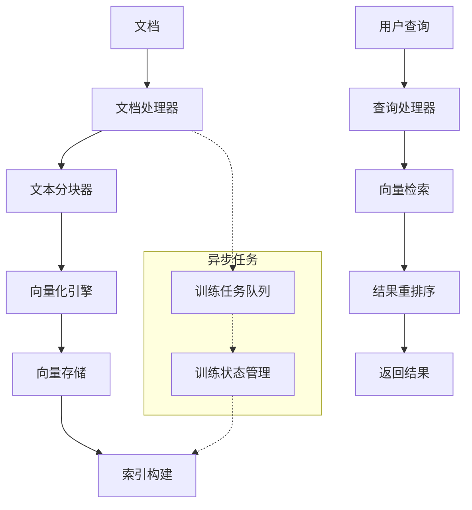

# RAG知识库训练功能设计文档

## 概述

本设计文档详细描述了基于_rag（Dify实现）的RAG知识库训练功能的架构设计和实现方案。该功能将废弃现有的GraphRAG方式，创建一个新的rag文件夹，实现完整的RAG知识库训练流程，包括文档处理、向量化、索引构建和检索等功能，并与现有的知识库系统无缝集成。

## 架构设计

### 整体架构

RAG知识库训练功能的整体架构如下：



### 核心组件

1. **文档处理器（DocumentProcessor）**：负责处理多种格式的文档，提取文本内容
2. **文本清理器（TextCleaner）**：负责清理和预处理文本内容
3. **文本分块器（TextSplitter）**：负责将长文本分割为适合向量化的文本块
4. **向量化引擎（EmbeddingEngine）**：负责将文本转换为向量表示
5. **向量存储（VectorStore）**：负责存储和管理向量数据
6. **索引构建器（IndexBuilder）**：负责构建向量索引和关键词索引
7. **查询处理器（QueryProcessor）**：负责处理用户查询
8. **检索引擎（RetrievalEngine）**：负责执行向量检索和关键词检索
9. **结果重排序器（Reranker）**：负责对检索结果进行重排序
10. **训练任务管理器（TrainingTaskManager）**：负责管理异步训练任务

### 数据流

1. **文档处理流程**：
   - 用户上传文档 → 文档处理器提取文本 → 文本清理 → 文本分块 → 向量化 → 存储向量和索引
   
2. **查询处理流程**：
   - 用户提交查询 → 查询处理器处理查询 → 向量化查询 → 检索相似文档 → 重排序结果 → 返回结果

### 与现有系统的集成

新的RAG功能将与现有的知识库系统进行无缝集成：

1. **数据模型集成**：扩展现有的KnowledgeBase和Document模型，添加RAG相关字段
2. **服务层集成**：在KnowledgeBaseService中添加RAG相关方法
3. **API集成**：保持现有API接口不变，内部实现替换为新的RAG实现
4. **权限系统集成**：复用现有的权限检查机制
5. **任务队列集成**：使用现有的Huey任务队列系统#
# 组件设计

### 1. 文档处理模块

#### 1.1 文档处理器（DocumentProcessor）

参考_rag/extractor/extract_processor.py实现，负责处理多种格式的文档。

```python
class DocumentProcessor:
    """文档处理器，负责处理多种格式的文档，提取文本内容"""
    
    def __init__(self):
        self.extractors = {
            ".pdf": PdfExtractor(),
            ".docx": WordExtractor(),
            ".xlsx": ExcelExtractor(),
            ".md": MarkdownExtractor(),
            ".html": HtmlExtractor(),
            ".txt": TextExtractor(),
            # 可扩展更多格式
        }
    
    async def process(self, document: Document) -> ProcessedDocument:
        """处理文档，提取文本内容"""
        file_extension = Path(document.file_path).suffix.lower()
        extractor = self.extractors.get(file_extension, TextExtractor())
        return await extractor.extract(document)
```

#### 1.2 文本清理器（TextCleaner）

参考_rag/cleaner/cleaner_base.py实现，负责清理和预处理文本内容。

```python
class TextCleaner:
    """文本清理器，负责清理和预处理文本内容"""
    
    def clean(self, text: str) -> str:
        """清理文本内容"""
        # 去除多余空白字符
        text = re.sub(r'\s+', ' ', text)
        # 去除特殊字符
        text = re.sub(r'[^\w\s\.\,\?\!\:\;\-\(\)]', '', text)
        # 更多清理规则...
        return text.strip()
```

#### 1.3 文本分块器（TextSplitter）

参考_rag/splitter/text_splitter.py实现，负责将长文本分割为适合向量化的文本块。

```python
class TextSplitter:
    """文本分块器，负责将长文本分割为适合向量化的文本块"""
    
    def __init__(self, chunk_size: int = 1000, chunk_overlap: int = 200):
        self.chunk_size = chunk_size
        self.chunk_overlap = chunk_overlap
    
    def split(self, text: str) -> List[str]:
        """分割文本"""
        # 实现文本分块逻辑
        chunks = []
        # 使用递归字符分割算法
        # ...
        return chunks
```

### 2. 向量化模块

#### 2.1 向量化引擎（EmbeddingEngine）

参考_rag/embedding/embedding_base.py和cached_embedding.py实现，负责将文本转换为向量表示。

```python
class EmbeddingEngine:
    """向量化引擎，负责将文本转换为向量表示"""
    
    def __init__(self, model_config: LLMConfig):
        self.model_config = model_config
        self.cache = {}  # 简单缓存实现
    
    async def embed_documents(self, texts: List[str]) -> List[List[float]]:
        """批量向量化文档"""
        results = []
        for text in texts:
            # 检查缓存
            text_hash = self._generate_hash(text)
            if text_hash in self.cache:
                results.append(self.cache[text_hash])
                continue
            
            # 调用嵌入模型API
            embedding = await self._call_embedding_api(text)
            self.cache[text_hash] = embedding
            results.append(embedding)
        
        return results
    
    async def embed_query(self, text: str) -> List[float]:
        """向量化查询"""
        # 查询通常不缓存，直接调用API
        return await self._call_embedding_api(text)
    
    async def _call_embedding_api(self, text: str) -> List[float]:
        """调用嵌入模型API"""
        # 实现调用嵌入模型API的逻辑
        # ...
        return []  # 返回向量
    
    def _generate_hash(self, text: str) -> str:
        """生成文本哈希值"""
        return hashlib.md5(text.encode()).hexdigest()
```

#### 2.2 向量存储（VectorStore）

参考_rag/datasource/vdb/vector_base.py和vector_factory.py实现，负责存储和管理向量数据。

```python
class VectorStore:
    """向量存储，负责存储和管理向量数据"""
    
    def __init__(self, collection_name: str):
        self.collection_name = collection_name
        # 初始化向量数据库连接
        # ...
    
    async def add(self, texts: List[str], embeddings: List[List[float]], metadata: List[Dict]) -> None:
        """添加向量数据"""
        # 实现添加向量数据的逻辑
        # ...
    
    async def search(self, query_vector: List[float], top_k: int = 5) -> List[Dict]:
        """搜索相似向量"""
        # 实现搜索相似向量的逻辑
        # ...
        return []  # 返回搜索结果
    
    async def delete(self, ids: List[str]) -> None:
        """删除向量数据"""
        # 实现删除向量数据的逻辑
        # ...
```

### 3. 索引和检索模块

#### 3.1 索引构建器（IndexBuilder）

参考_rag/index_processor/index_processor_base.py实现，负责构建向量索引和关键词索引。

```python
class IndexBuilder:
    """索引构建器，负责构建向量索引和关键词索引"""
    
    def __init__(self, knowledge_base_id: int, vector_store: VectorStore):
        self.knowledge_base_id = knowledge_base_id
        self.vector_store = vector_store
    
    async def build_index(self, documents: List[Document]) -> None:
        """构建索引"""
        # 实现构建索引的逻辑
        # ...
    
    async def update_index(self, documents: List[Document]) -> None:
        """更新索引"""
        # 实现更新索引的逻辑
        # ...
    
    async def delete_index(self) -> None:
        """删除索引"""
        # 实现删除索引的逻辑
        # ...
```

#### 3.2 检索引擎（RetrievalEngine）

参考_rag/retrieval/dataset_retrieval.py实现，负责执行向量检索和关键词检索。

```python
class RetrievalEngine:
    """检索引擎，负责执行向量检索和关键词检索"""
    
    def __init__(self, vector_store: VectorStore, embedding_engine: EmbeddingEngine):
        self.vector_store = vector_store
        self.embedding_engine = embedding_engine
    
    async def semantic_search(self, query: str, top_k: int = 5) -> List[Dict]:
        """语义搜索"""
        # 向量化查询
        query_vector = await self.embedding_engine.embed_query(query)
        # 执行向量检索
        results = await self.vector_store.search(query_vector, top_k)
        return results
    
    async def keyword_search(self, query: str, top_k: int = 5) -> List[Dict]:
        """关键词搜索"""
        # 实现关键词搜索的逻辑
        # ...
        return []  # 返回搜索结果
    
    async def hybrid_search(self, query: str, top_k: int = 5) -> List[Dict]:
        """混合搜索"""
        # 同时执行语义搜索和关键词搜索，合并结果
        semantic_results = await self.semantic_search(query, top_k)
        keyword_results = await self.keyword_search(query, top_k)
        # 合并结果
        # ...
        return []  # 返回合并后的结果
```

#### 3.3 结果重排序器（Reranker）

参考_rag/rerank/rerank_base.py实现，负责对检索结果进行重排序。

```python
class Reranker:
    """结果重排序器，负责对检索结果进行重排序"""
    
    def __init__(self, model_config: Optional[Dict] = None):
        self.model_config = model_config
    
    async def rerank(self, query: str, results: List[Dict]) -> List[Dict]:
        """重排序结果"""
        # 实现重排序逻辑
        # ...
        return results  # 返回重排序后的结果
```

### 4. 训练任务管理

#### 4.1 训练任务管理器（TrainingTaskManager）

负责管理异步训练任务。

```python
class TrainingTaskManager:
    """训练任务管理器，负责管理异步训练任务"""
    
    def __init__(self, db: Session):
        self.db = db
    
    async def create_task(self, knowledge_base_id: int, user_id: int) -> None:
        """创建训练任务"""
        # 检查知识库状态
        # 创建异步任务
        # ...
    
    async def process_task(self, knowledge_base_id: int) -> None:
        """处理训练任务"""
        # 获取知识库信息
        # 处理文档
        # 构建索引
        # 更新知识库状态
        # ...
    
    async def check_queue(self) -> None:
        """检查任务队列"""
        # 检查是否有等待中的任务
        # 启动下一个任务
        # ...
```## 数据
模型设计

### 1. 数据模型扩展

为了支持RAG功能，需要扩展现有的数据模型。

#### 1.1 DocumentChunk模型

```python
class DocumentChunk(Base):
    """文档分块模型，存储文档分块信息"""
    __tablename__ = "document_chunks"
    __table_args__ = {'comment': '文档分块表，存储文档分块信息'}

    id = Column(Integer, primary_key=True, index=True, comment='分块ID')
    document_id = Column(Integer, ForeignKey("documents.id", ondelete="CASCADE"), nullable=False, comment='文档ID')
    content = Column(Text, nullable=False, comment='分块内容')
    chunk_index = Column(Integer, nullable=False, comment='分块索引')
    metadata = Column(JSON, nullable=True, comment='分块元数据')
    
    # 时间字段
    created_at = Column(DateTime, default=datetime.now, comment="创建时间")
    updated_at = Column(DateTime, default=datetime.now, onupdate=datetime.now, comment="更新时间")
    
    # 关系定义
    document = relationship("Document", back_populates="chunks", passive_deletes=True)
    embeddings = relationship("DocumentEmbedding", back_populates="chunk", cascade="all, delete-orphan", passive_deletes=True)
```

#### 1.2 DocumentEmbedding模型

```python
class DocumentEmbedding(Base):
    """文档向量模型，存储文档向量信息"""
    __tablename__ = "document_embeddings"
    __table_args__ = {'comment': '文档向量表，存储文档向量信息'}

    id = Column(Integer, primary_key=True, index=True, comment='向量ID')
    chunk_id = Column(Integer, ForeignKey("document_chunks.id", ondelete="CASCADE"), nullable=False, comment='分块ID')
    embedding = Column(JSON, nullable=False, comment='向量数据')
    model = Column(String, nullable=False, comment='嵌入模型')
    
    # 时间字段
    created_at = Column(DateTime, default=datetime.now, comment="创建时间")
    
    # 关系定义
    chunk = relationship("DocumentChunk", back_populates="embeddings", passive_deletes=True)
```

#### 1.3 扩展Document模型

```python
# 在现有的Document模型中添加关系
chunks = relationship("DocumentChunk", back_populates="document", cascade="all, delete-orphan", passive_deletes=True)
```

#### 1.4 扩展KnowledgeBase模型

```python
# 在现有的KnowledgeBase模型中添加字段
indexing_technique = Column(String, nullable=False, default="high_quality", comment='索引技术（high_quality或economy）')
embedding_model = Column(String, nullable=True, comment='嵌入模型名称')
embedding_model_provider = Column(String, nullable=True, comment='嵌入模型提供商')
vector_store_type = Column(String, nullable=True, comment='向量存储类型')
```

### 2. 配置扩展

在app/core/config.py中添加RAG相关配置：

```python
# RAG配置
RAG_CHUNK_SIZE: int = 1000
RAG_CHUNK_OVERLAP: int = 200
RAG_VECTOR_STORE_TYPE: str = "chroma"  # 默认向量存储类型
RAG_BATCH_SIZE: int = 100  # 批处理大小
RAG_RERANK_MODEL: str = "bge-reranker-base"  # 重排序模型
```

## 接口设计

### 1. 服务层接口

在KnowledgeBaseService中添加RAG相关方法：

```python
class KnowledgeBaseService:
    # 现有方法...
    
    async def train_rag(self, kb_id: int, user_id: int) -> KnowledgeBase:
        """训练RAG知识库"""
        # 实现训练RAG知识库的逻辑
        # ...
        
    async def query_rag(
        self,
        kb_id: int,
        user_context: UserContext,
        query: str,
        top_k: int = 5,
        skip_permission_check: bool = False
    ) -> dict:
        """RAG查询知识库"""
        # 实现RAG查询知识库的逻辑
        # ...
```

### 2. API接口

保持现有API接口不变，内部实现替换为新的RAG实现：

```python
@router.post("/{kb_id}/train")
async def train_knowledge_base(
    kb_id: int,
    current_user: User = Depends(get_current_user)
):
    """训练知识库"""
    # 调用KnowledgeBaseService.train_rag方法
    # ...
    
@router.post("/{kb_id}/query")
async def query_knowledge_base(
    kb_id: int,
    query: QueryRequest,
    current_user: User = Depends(get_current_user)
):
    """查询知识库"""
    # 调用KnowledgeBaseService.query_rag方法
    # ...
```

## 异步任务设计

### 1. 训练任务

在app/utils/tasks.py中添加RAG训练任务：

```python
@huey.task()
def train_rag_knowledge_base(kb_id: int):
    """异步训练RAG知识库任务"""
    # 创建异步上下文
    async def _train():
        async with AsyncSessionLocal() as db:
            # 获取知识库服务
            kb_service = KnowledgeBaseService(db)
            # 获取知识库
            kb = await kb_service.get_by_id(kb_id)
            if not kb:
                Logger.error(f"训练失败：知识库 {kb_id} 不存在")
                return
                
            try:
                # 更新知识库状态为训练中
                kb.training_status = TrainingStatus.TRAINING
                kb.training_started_at = datetime.now()
                await db.commit()
                
                # 获取知识库文档
                documents = await kb_service.get_documents(kb_id)
                
                # 创建RAG训练管理器
                rag_manager = RAGTrainingManager(db, kb)
                
                # 执行训练流程
                await rag_manager.train(documents)
                
                # 更新知识库状态为已训练
                kb.training_status = TrainingStatus.TRAINED
                kb.training_finished_at = datetime.now()
                await db.commit()
                
                # 检查队列中是否有其他任务
                await kb_service.check_training_queue()
                
            except Exception as e:
                # 更新知识库状态为训练失败
                kb.training_status = TrainingStatus.FAILED
                kb.training_error = str(e)
                await db.commit()
                Logger.error(f"训练失败：{str(e)}")
                
    # 运行异步任务
    asyncio.run(_train())
```

## 错误处理

### 1. 异常类型

```python
class RAGException(Exception):
    """RAG异常基类"""
    pass
    
class DocumentProcessingException(RAGException):
    """文档处理异常"""
    pass
    
class EmbeddingException(RAGException):
    """向量化异常"""
    pass
    
class IndexingException(RAGException):
    """索引异常"""
    pass
    
class RetrievalException(RAGException):
    """检索异常"""
    pass
```

### 2. 错误处理策略

1. **文档处理错误**：记录错误信息，跳过错误文档，继续处理其他文档
2. **向量化错误**：实现重试机制，最多重试3次，如果仍然失败则记录错误并跳过
3. **索引错误**：记录错误信息，回滚已处理的数据，将知识库状态设置为训练失败
4. **检索错误**：记录错误信息，返回适当的错误响应

## 测试策略

### 1. 单元测试

为每个核心组件编写单元测试：

1. **DocumentProcessor测试**：测试不同格式文档的处理
2. **TextSplitter测试**：测试文本分块的正确性
3. **EmbeddingEngine测试**：测试向量化功能
4. **VectorStore测试**：测试向量存储和检索
5. **RetrievalEngine测试**：测试检索功能

### 2. 集成测试

1. **端到端训练测试**：测试完整的训练流程
2. **端到端查询测试**：测试完整的查询流程
3. **权限测试**：测试权限控制
4. **错误处理测试**：测试各种错误场景

## 性能优化

### 1. 批处理

使用批处理提高向量化和存储效率：

```python
async def batch_process(self, texts: List[str], batch_size: int = 100) -> List[List[float]]:
    """批量处理文本"""
    results = []
    for i in range(0, len(texts), batch_size):
        batch = texts[i:i+batch_size]
        batch_results = await self.process(batch)
        results.extend(batch_results)
    return results
```

### 2. 缓存

使用Redis缓存向量化结果：

```python
async def get_cached_embedding(self, text: str) -> Optional[List[float]]:
    """获取缓存的向量"""
    text_hash = self._generate_hash(text)
    cache_key = f"embedding:{text_hash}"
    cached = await redis_manager.get(cache_key)
    if cached:
        return json.loads(cached)
    return None
    
async def cache_embedding(self, text: str, embedding: List[float]) -> None:
    """缓存向量"""
    text_hash = self._generate_hash(text)
    cache_key = f"embedding:{text_hash}"
    await redis_manager.set(cache_key, json.dumps(embedding), expire=timedelta(days=7))
```

### 3. 并发控制

使用信号量控制并发：

```python
async def process_documents(self, documents: List[Document], max_concurrency: int = 5) -> List[ProcessedDocument]:
    """并发处理文档"""
    semaphore = asyncio.Semaphore(max_concurrency)
    
    async def process_with_semaphore(document):
        async with semaphore:
            return await self.process(document)
    
    tasks = [process_with_semaphore(doc) for doc in documents]
    return await asyncio.gather(*tasks)
```

## 安全考虑

1. **权限控制**：严格检查用户权限，确保只有授权用户可以访问和操作知识库
2. **数据隔离**：确保不同知识库的数据完全隔离
3. **输入验证**：验证所有用户输入，防止注入攻击
4. **审计日志**：记录所有关键操作的审计日志
5. **敏感数据处理**：确保向量数据不泄露原始文档内容

## 部署考虑

1. **资源需求**：
   - CPU：至少4核
   - 内存：至少8GB
   - 存储：根据知识库大小，至少10GB
   
2. **依赖服务**：
   - 数据库：SQLite
   - Redis：用于缓存
   - 向量数据库：根据配置选择（Chroma、Qdrant等）
   
3. **扩展性**：
   - 支持水平扩展向量数据库
   - 支持分布式训练任务
   - 支持多实例部署