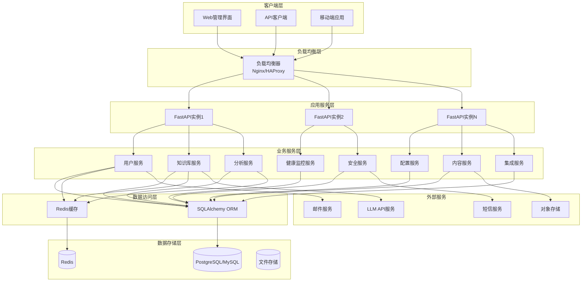
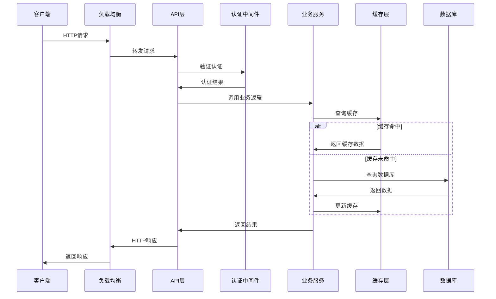
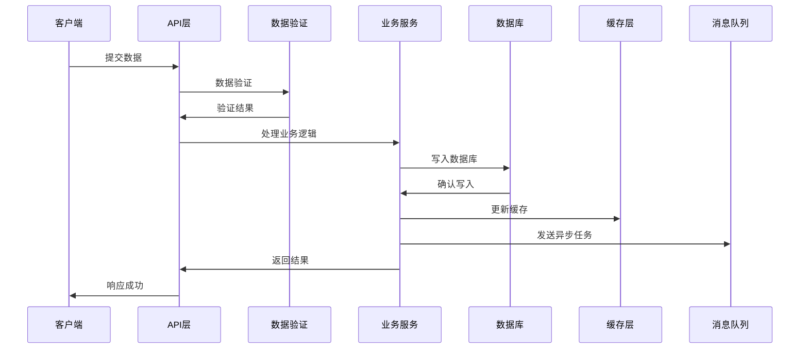
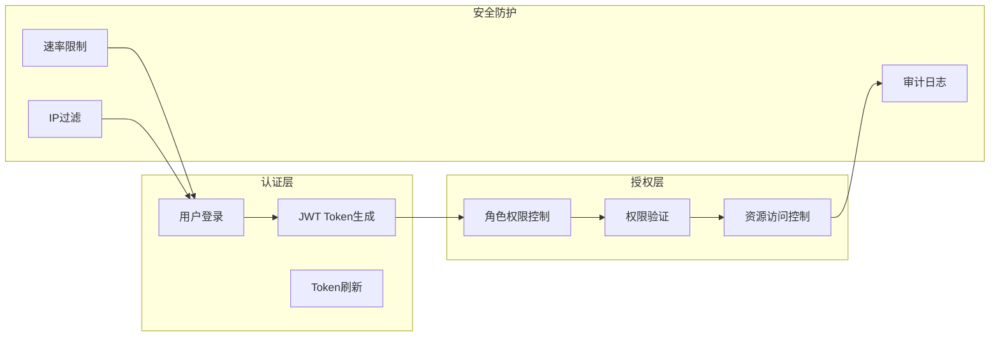
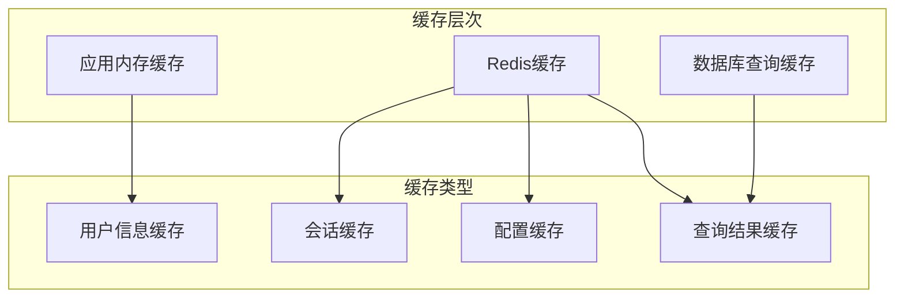
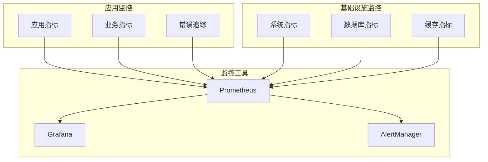
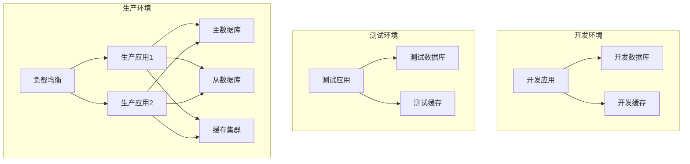

# EmbedAI 系统架构概览

## 系统简介

EmbedAI管理后台是一个基于FastAPI的现代化企业级管理系统，采用异步架构设计，提供完整的用户管理、知识库管理、分析报告、系统监控等功能。

## 技术栈

### 后端技术栈

| 组件 | 技术选型 | 版本 | 用途 |
|------|----------|------|------|
| Web框架 | FastAPI | 0.104+ | 高性能异步Web框架 |
| 数据库ORM | SQLAlchemy | 2.0+ | 异步ORM框架 |
| 数据库 | PostgreSQL/MySQL/SQLite | - | 关系型数据库 |
| 缓存 | Redis | 7.0+ | 缓存和会话存储 |
| 认证 | JWT + bcrypt | - | 用户认证和密码加密 |
| 数据验证 | Pydantic | 2.0+ | 数据模型和验证 |
| 异步任务 | Celery + Redis | - | 后台任务处理 |
| 文件存储 | 本地/S3/OSS | - | 文件和文档存储 |
| 日志 | Python Logging | - | 结构化日志记录 |
| 监控 | Prometheus + Grafana | - | 系统监控和告警 |

### 开发工具

| 工具 | 用途 |
|------|------|
| Alembic | 数据库迁移 |
| pytest | 单元测试和集成测试 |
| Black | 代码格式化 |
| isort | 导入排序 |
| mypy | 类型检查 |
| pre-commit | Git钩子 |

## 系统架构图



## 模块架构

### 核心模块结构

```
app/
├── api/                    # API路由层
│   └── v1/                # API版本1
│       ├── admin/         # 管理员API
│       ├── client/        # 客户端API
│       ├── chat/          # 对话API
│       └── ws/            # WebSocket API
├── core/                  # 核心组件
│   ├── config.py         # 配置管理
│   ├── security.py       # 安全组件
│   ├── logger.py         # 日志组件
│   ├── response.py       # 响应格式
│   ├── exceptions.py     # 异常定义
│   └── middleware/       # 中间件
├── models/               # 数据模型
│   ├── database.py       # 数据库配置
│   ├── user.py          # 用户模型
│   ├── knowledge_base.py # 知识库模型
│   └── ...              # 其他模型
├── schemas/              # 数据验证模式
│   ├── user.py          # 用户Schema
│   ├── knowledge_base.py # 知识库Schema
│   └── ...              # 其他Schema
├── services/             # 业务服务层
│   ├── user.py          # 用户服务
│   ├── analytics.py     # 分析服务
│   ├── auth.py          # 认证服务
│   └── ...              # 其他服务
└── utils/               # 工具函数
    ├── rate_limit.py    # 速率限制
    ├── file_handler.py  # 文件处理
    └── ...              # 其他工具
```

### 模块职责

#### 1. API层 (`app/api/`)
- **职责**: 处理HTTP请求，路由分发，参数验证
- **特点**: 
  - 按功能模块和用户角色分组
  - 统一的错误处理和响应格式
  - 支持版本控制

#### 2. 核心组件 (`app/core/`)
- **职责**: 提供系统基础功能和通用组件
- **包含**:
  - 配置管理：环境变量、数据库配置
  - 安全组件：JWT认证、密码加密
  - 日志系统：结构化日志记录
  - 响应格式：统一的API响应

#### 3. 数据模型 (`app/models/`)
- **职责**: 定义数据库表结构和关系
- **特点**:
  - 使用SQLAlchemy ORM
  - 支持异步操作
  - 完整的关系定义

#### 4. 数据验证 (`app/schemas/`)
- **职责**: 定义API输入输出的数据格式
- **特点**:
  - 使用Pydantic进行数据验证
  - 自动生成API文档
  - 类型安全

#### 5. 业务服务 (`app/services/`)
- **职责**: 实现核心业务逻辑
- **特点**:
  - 单一职责原则
  - 可测试性强
  - 支持依赖注入

## 数据流向

### 请求处理流程



### 数据写入流程



## 安全架构

### 认证授权流程



### 安全措施

1. **认证安全**
   - JWT Token认证
   - 密码bcrypt加密
   - 双因子认证支持
   - 会话管理

2. **授权控制**
   - 基于角色的访问控制(RBAC)
   - 细粒度权限管理
   - 资源级别访问控制

3. **数据安全**
   - 敏感数据加密存储
   - 数据传输HTTPS加密
   - SQL注入防护
   - XSS攻击防护

4. **系统安全**
   - IP白名单/黑名单
   - 速率限制
   - 安全事件监控
   - 审计日志记录

## 性能架构

### 缓存策略



### 性能优化策略

1. **数据库优化**
   - 索引优化
   - 查询优化
   - 连接池管理
   - 读写分离

2. **缓存优化**
   - 多级缓存
   - 缓存预热
   - 缓存更新策略
   - 缓存穿透防护

3. **异步处理**
   - 异步I/O操作
   - 后台任务队列
   - 批量处理
   - 流式处理

4. **资源优化**
   - 连接复用
   - 内存管理
   - CPU优化
   - 网络优化

## 监控架构

### 监控体系



### 关键指标

1. **应用指标**
   - 请求响应时间
   - 请求成功率
   - 并发用户数
   - API调用频率

2. **业务指标**
   - 用户活跃度
   - 知识库使用率
   - 查询成功率
   - 系统功能使用情况

3. **系统指标**
   - CPU使用率
   - 内存使用率
   - 磁盘I/O
   - 网络流量

4. **数据库指标**
   - 连接数
   - 查询性能
   - 锁等待时间
   - 缓存命中率

## 扩展性设计

### 水平扩展

1. **应用层扩展**
   - 无状态应用设计
   - 负载均衡
   - 容器化部署
   - 微服务架构准备

2. **数据层扩展**
   - 数据库读写分离
   - 分库分表
   - 缓存集群
   - 分布式存储

### 垂直扩展

1. **性能优化**
   - 代码优化
   - 算法优化
   - 资源配置优化
   - 硬件升级

2. **功能扩展**
   - 插件化架构
   - API扩展
   - 第三方集成
   - 自定义开发

## 部署架构

### 部署环境



### 容器化部署

```yaml
# docker-compose.yml 示例
version: '3.8'
services:
  app:
    build: .
    ports:
      - "8000:8000"
    environment:
      - DATABASE_URL=postgresql://user:pass@db:5432/embedai
      - REDIS_URL=redis://redis:6379
    depends_on:
      - db
      - redis
    
  db:
    image: postgres:15
    environment:
      - POSTGRES_DB=embedai
      - POSTGRES_USER=user
      - POSTGRES_PASSWORD=pass
    volumes:
      - postgres_data:/var/lib/postgresql/data
    
  redis:
    image: redis:7-alpine
    volumes:
      - redis_data:/data
    
  nginx:
    image: nginx:alpine
    ports:
      - "80:80"
      - "443:443"
    volumes:
      - ./nginx.conf:/etc/nginx/nginx.conf
    depends_on:
      - app

volumes:
  postgres_data:
  redis_data:
```

## 技术决策

### 架构选择理由

1. **FastAPI选择**
   - 高性能异步框架
   - 自动API文档生成
   - 类型安全支持
   - 现代Python特性

2. **SQLAlchemy ORM**
   - 成熟的ORM框架
   - 异步支持
   - 灵活的查询接口
   - 数据库无关性

3. **Redis缓存**
   - 高性能内存数据库
   - 丰富的数据结构
   - 持久化支持
   - 集群扩展能力

4. **JWT认证**
   - 无状态认证
   - 跨域支持
   - 标准化协议
   - 易于扩展

### 未来演进方向

1. **微服务化**
   - 服务拆分
   - 服务治理
   - 分布式追踪
   - 服务网格

2. **云原生**
   - Kubernetes部署
   - 服务发现
   - 配置管理
   - 自动扩缩容

3. **AI集成**
   - 智能分析
   - 自动化运维
   - 预测性维护
   - 智能推荐

## 总结

EmbedAI管理后台系统采用现代化的技术架构，具备高性能、高可用、高扩展性的特点。通过合理的模块划分、完善的安全机制、高效的缓存策略和全面的监控体系，为企业级应用提供了坚实的技术基础。

系统设计充分考虑了未来的扩展需求，支持从单体应用向微服务架构的平滑演进，为业务的快速发展提供了技术保障。
