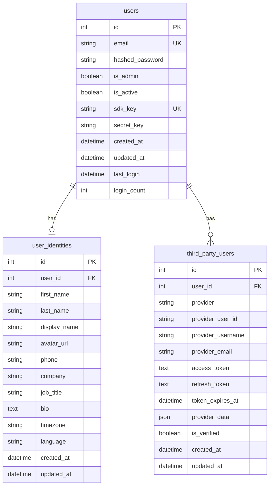

# 用户管理相关数据表

## 概述

用户管理模块包含用户基础信息、身份认证、第三方用户等相关数据表。这些表构成了系统的用户管理基础。

## 表结构详情

### 1. users - 用户基础信息表

**表名**: `users`
**用途**: 存储系统用户的基础信息和认证数据

#### 字段定义

| 字段名 | 数据类型 | 约束 | 默认值 | 描述 |
|--------|----------|------|--------|------|
| id | Integer | PRIMARY KEY, AUTO_INCREMENT | - | 用户唯一标识 |
| email | String(255) | NOT NULL, UNIQUE | - | 用户邮箱地址 |
| hashed_password | String(255) | NOT NULL | - | 加密后的密码 |
| is_admin | Boolean | NOT NULL | False | 是否为管理员 |
| is_active | Boolean | NOT NULL | True | 账户是否激活 |
| sdk_key | String(64) | UNIQUE | - | SDK访问密钥 |
| secret_key | String(64) | - | - | 密钥对应的秘钥 |
| created_at | DateTime | NOT NULL | CURRENT_TIMESTAMP | 创建时间 |
| updated_at | DateTime | - | CURRENT_TIMESTAMP | 更新时间 |
| last_login | DateTime | - | - | 最后登录时间 |
| login_count | Integer | NOT NULL | 0 | 登录次数统计 |

#### 索引

```sql
-- 主键索引
PRIMARY KEY (id)

-- 唯一索引
UNIQUE INDEX idx_users_email (email)
UNIQUE INDEX idx_users_sdk_key (sdk_key)

-- 复合索引
INDEX idx_users_active_created (is_active, created_at)

-- 普通索引
INDEX idx_users_last_login (last_login)
```

#### 约束

```sql
-- 邮箱格式检查
CONSTRAINT chk_users_email_format 
CHECK (email REGEXP '^[A-Za-z0-9._%+-]+@[A-Za-z0-9.-]+\.[A-Za-z]{2,}$')

-- 密码长度检查（bcrypt哈希长度为60）
CONSTRAINT chk_users_password_length 
CHECK (LENGTH(hashed_password) = 60)

-- SDK密钥长度检查
CONSTRAINT chk_users_sdk_key_length 
CHECK (sdk_key IS NULL OR LENGTH(sdk_key) = 32)
```

#### 使用示例

```python
from app.models.user import User
from app.models.database import AsyncSessionLocal

# 创建用户
async def create_user_example():
    async with AsyncSessionLocal() as db:
        new_user = User(
            email="user@example.com",
            hashed_password="$2b$12$...",  # bcrypt哈希
            is_admin=False,
            sdk_key="sk_test_1234567890abcdef1234567890abcdef"
        )
        db.add(new_user)
        await db.commit()
        await db.refresh(new_user)
        return new_user

# 查询用户
async def get_user_by_email(email: str):
    async with AsyncSessionLocal() as db:
        result = await db.execute(
            select(User).where(User.email == email)
        )
        return result.scalar_one_or_none()
```

### 2. user_identities - 用户身份信息表

**表名**: `user_identities`
**用途**: 存储用户的详细身份信息和个人资料

#### 字段定义

| 字段名 | 数据类型 | 约束 | 默认值 | 描述 |
|--------|----------|------|--------|------|
| id | Integer | PRIMARY KEY, AUTO_INCREMENT | - | 身份信息ID |
| user_id | Integer | NOT NULL, FOREIGN KEY | - | 关联用户ID |
| first_name | String(100) | - | - | 名字 |
| last_name | String(100) | - | - | 姓氏 |
| display_name | String(200) | - | - | 显示名称 |
| avatar_url | String(500) | - | - | 头像URL |
| phone | String(20) | - | - | 电话号码 |
| company | String(200) | - | - | 公司名称 |
| job_title | String(100) | - | - | 职位 |
| bio | Text | - | - | 个人简介 |
| timezone | String(50) | - | 'UTC' | 时区 |
| language | String(10) | - | 'en' | 语言偏好 |
| created_at | DateTime | NOT NULL | CURRENT_TIMESTAMP | 创建时间 |
| updated_at | DateTime | - | CURRENT_TIMESTAMP | 更新时间 |

#### 外键关系

```sql
CONSTRAINT fk_user_identities_user_id 
FOREIGN KEY (user_id) REFERENCES users(id) ON DELETE CASCADE
```

#### 索引

```sql
-- 外键索引
INDEX idx_user_identities_user_id (user_id)

-- 搜索索引
INDEX idx_user_identities_display_name (display_name)
INDEX idx_user_identities_company (company)
```

#### 使用示例

```python
from app.models.identity import UserIdentity

# 创建用户身份信息
async def create_user_identity(user_id: int):
    async with AsyncSessionLocal() as db:
        identity = UserIdentity(
            user_id=user_id,
            first_name="John",
            last_name="Doe",
            display_name="John Doe",
            company="Tech Corp",
            job_title="Software Engineer",
            timezone="America/New_York"
        )
        db.add(identity)
        await db.commit()
        return identity

# 获取用户完整信息
async def get_user_with_identity(user_id: int):
    async with AsyncSessionLocal() as db:
        result = await db.execute(
            select(User)
            .options(selectinload(User.identity))
            .where(User.id == user_id)
        )
        return result.scalar_one_or_none()
```

### 3. third_party_users - 第三方用户表

**表名**: `third_party_users`
**用途**: 存储通过第三方平台（如OAuth）注册的用户信息

#### 字段定义

| 字段名 | 数据类型 | 约束 | 默认值 | 描述 |
|--------|----------|------|--------|------|
| id | Integer | PRIMARY KEY, AUTO_INCREMENT | - | 第三方用户ID |
| user_id | Integer | NOT NULL, FOREIGN KEY | - | 关联用户ID |
| provider | String(50) | NOT NULL | - | 第三方提供商 |
| provider_user_id | String(255) | NOT NULL | - | 第三方用户ID |
| provider_username | String(255) | - | - | 第三方用户名 |
| provider_email | String(255) | - | - | 第三方邮箱 |
| access_token | Text | - | - | 访问令牌 |
| refresh_token | Text | - | - | 刷新令牌 |
| token_expires_at | DateTime | - | - | 令牌过期时间 |
| provider_data | JSON | - | - | 第三方返回的原始数据 |
| is_verified | Boolean | NOT NULL | False | 是否已验证 |
| created_at | DateTime | NOT NULL | CURRENT_TIMESTAMP | 创建时间 |
| updated_at | DateTime | - | CURRENT_TIMESTAMP | 更新时间 |

#### 外键关系

```sql
CONSTRAINT fk_third_party_users_user_id 
FOREIGN KEY (user_id) REFERENCES users(id) ON DELETE CASCADE
```

#### 索引

```sql
-- 复合唯一索引（防止重复绑定）
UNIQUE INDEX idx_third_party_provider_user (provider, provider_user_id)

-- 外键索引
INDEX idx_third_party_users_user_id (user_id)

-- 查询索引
INDEX idx_third_party_provider (provider)
INDEX idx_third_party_email (provider_email)
```

#### 约束

```sql
-- 提供商类型检查
CONSTRAINT chk_third_party_provider 
CHECK (provider IN ('google', 'github', 'microsoft', 'facebook', 'twitter'))

-- 第三方用户ID不能为空
CONSTRAINT chk_third_party_provider_user_id 
CHECK (LENGTH(provider_user_id) > 0)
```

#### 使用示例

```python
from app.models.third_party_user import ThirdPartyUser

# 创建第三方用户绑定
async def create_oauth_binding(user_id: int, oauth_data: dict):
    async with AsyncSessionLocal() as db:
        third_party_user = ThirdPartyUser(
            user_id=user_id,
            provider=oauth_data['provider'],
            provider_user_id=oauth_data['id'],
            provider_username=oauth_data.get('username'),
            provider_email=oauth_data.get('email'),
            access_token=oauth_data['access_token'],
            refresh_token=oauth_data.get('refresh_token'),
            provider_data=oauth_data,
            is_verified=True
        )
        db.add(third_party_user)
        await db.commit()
        return third_party_user

# 通过第三方信息查找用户
async def find_user_by_oauth(provider: str, provider_user_id: str):
    async with AsyncSessionLocal() as db:
        result = await db.execute(
            select(ThirdPartyUser)
            .options(selectinload(ThirdPartyUser.user))
            .where(
                ThirdPartyUser.provider == provider,
                ThirdPartyUser.provider_user_id == provider_user_id
            )
        )
        return result.scalar_one_or_none()
```

## 表关系说明

### 关系图



### 关系说明

1. **users ↔ user_identities (1:1)**
   - 一个用户对应一个身份信息记录
   - 级联删除：删除用户时同时删除身份信息

2. **users ↔ third_party_users (1:N)**
   - 一个用户可以绑定多个第三方账户
   - 级联删除：删除用户时同时删除所有第三方绑定

## 数据完整性

### 业务规则

1. **用户邮箱唯一性**
   - 系统内邮箱必须唯一
   - 不区分大小写

2. **SDK密钥唯一性**
   - 每个用户的SDK密钥必须唯一
   - 用于API访问认证

3. **第三方绑定唯一性**
   - 同一个第三方账户只能绑定一个系统用户
   - 通过 (provider, provider_user_id) 保证唯一性

### 数据验证

```python
# 用户数据验证示例
from pydantic import BaseModel, EmailStr, validator

class UserCreate(BaseModel):
    email: EmailStr
    password: str
    
    @validator('password')
    def validate_password(cls, v):
        if len(v) < 8:
            raise ValueError('密码长度至少8位')
        if not any(c.isupper() for c in v):
            raise ValueError('密码必须包含大写字母')
        if not any(c.islower() for c in v):
            raise ValueError('密码必须包含小写字母')
        if not any(c.isdigit() for c in v):
            raise ValueError('密码必须包含数字')
        return v
```

## 性能优化

### 查询优化

1. **用户登录查询**
   ```python
   # 优化的登录查询
   async def authenticate_user(email: str, password: str):
       async with AsyncSessionLocal() as db:
           # 使用邮箱索引快速查找
           result = await db.execute(
               select(User).where(
                   User.email == email.lower(),
                   User.is_active == True
               )
           )
           user = result.scalar_one_or_none()
           
           if user and verify_password(password, user.hashed_password):
               # 更新登录信息
               user.last_login = datetime.now()
               user.login_count += 1
               await db.commit()
               return user
           return None
   ```

2. **用户列表查询**
   ```python
   # 分页查询优化
   async def get_users_paginated(skip: int, limit: int, search: str = None):
       async with AsyncSessionLocal() as db:
           query = select(User)
           
           if search:
               # 使用邮箱索引进行搜索
               query = query.where(User.email.ilike(f'%{search}%'))
           
           # 使用复合索引排序
           query = query.order_by(User.is_active.desc(), User.created_at.desc())
           query = query.offset(skip).limit(limit)
           
           result = await db.execute(query)
           return result.scalars().all()
   ```

### 缓存策略

```python
from app.core.redis_manager import redis_manager
import json

# 用户信息缓存
async def get_user_cached(user_id: int):
    cache_key = f"user:{user_id}"
    
    # 尝试从缓存获取
    cached_data = await redis_manager.get(cache_key)
    if cached_data:
        return User(**json.loads(cached_data))
    
    # 从数据库查询
    async with AsyncSessionLocal() as db:
        user = await db.get(User, user_id)
        if user:
            # 缓存30分钟
            await redis_manager.setex(
                cache_key, 
                1800, 
                json.dumps(user.dict())
            )
        return user
```

## 安全考虑

### 密码安全

```python
from passlib.context import CryptContext

pwd_context = CryptContext(schemes=["bcrypt"], deprecated="auto")

def hash_password(password: str) -> str:
    """安全地哈希密码"""
    return pwd_context.hash(password)

def verify_password(plain_password: str, hashed_password: str) -> bool:
    """验证密码"""
    return pwd_context.verify(plain_password, hashed_password)
```

### 敏感数据保护

1. **令牌加密存储**
   ```python
   from cryptography.fernet import Fernet
   
   def encrypt_token(token: str, key: bytes) -> str:
       """加密存储访问令牌"""
       f = Fernet(key)
       return f.encrypt(token.encode()).decode()
   
   def decrypt_token(encrypted_token: str, key: bytes) -> str:
       """解密访问令牌"""
       f = Fernet(key)
       return f.decrypt(encrypted_token.encode()).decode()
   ```

2. **数据脱敏**
   ```python
   def mask_email(email: str) -> str:
       """邮箱脱敏显示"""
       local, domain = email.split('@')
       if len(local) <= 2:
           return f"{local[0]}***@{domain}"
       return f"{local[:2]}***@{domain}"
   ```

## 维护操作

### 数据清理

```sql
-- 清理未激活的过期用户（30天）
DELETE FROM users 
WHERE is_active = FALSE 
  AND created_at < NOW() - INTERVAL 30 DAY;

-- 清理过期的第三方令牌
UPDATE third_party_users 
SET access_token = NULL, refresh_token = NULL 
WHERE token_expires_at < NOW();
```

### 数据统计

```sql
-- 用户统计查询
SELECT 
    COUNT(*) as total_users,
    COUNT(CASE WHEN is_active = TRUE THEN 1 END) as active_users,
    COUNT(CASE WHEN is_admin = TRUE THEN 1 END) as admin_users,
    COUNT(CASE WHEN created_at >= CURDATE() THEN 1 END) as new_today
FROM users;

-- 第三方用户统计
SELECT 
    provider,
    COUNT(*) as user_count,
    COUNT(CASE WHEN is_verified = TRUE THEN 1 END) as verified_count
FROM third_party_users 
GROUP BY provider;
```
