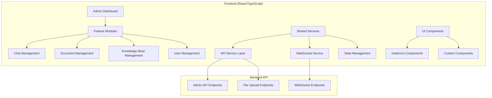

# Design Document

## Overview

This design document outlines the architecture and implementation approach for enhancing the EmbedAI admin dashboard with comprehensive API integration. The system will build upon the existing React/TypeScript foundation, extending current patterns for authentication, state management, and UI components to support chat management, enhanced document operations, and improved user experience features.

The design follows the established patterns in the codebase using React Query for data fetching, Zustand for state management, and shadcn/ui components for consistent UI design.

## Architecture

### High-Level Architecture



### Service Layer Architecture

The existing `adminService` will be extended with new methods following the established singleton pattern:

```typescript
class AdminService {
  // Existing methods...
  
  // Chat Management
  async getChats(params: GetChatsQuery): Promise<ApiResponse<PaginationData<Chat>>>
  async getChatMessages(chatId: string): Promise<ApiResponse<ChatMessage[]>>
  async sendChatMessage(chatId: string, data: ChatMessageCreate): Promise<ApiResponse<ChatMessage>>
  
  // Document Management Extensions
  async uploadDocument(kbId: number, file: File): Promise<ApiResponse<Document>>
  async reprocessDocument(docId: number): Promise<ApiResponse<Document>>
  
  // WebSocket Management
  createChatWebSocket(chatId: string, adminId: number): WebSocket
}
```

### State Management Strategy

Building on the existing Zustand store pattern, new stores will be created:

1. **Chat Store** - Manages chat conversations and real-time message state
2. **Document Store** - Handles document operations and upload progress
3. **Notification Store** - Manages system notifications and status updates

## Components and Interfaces

### Chat Management Components

#### ChatList Component
- Displays paginated list of chat conversations
- Supports filtering by status, user, and date range
- Integrates with existing table patterns from knowledge-bases and users features

#### ChatDetail Component
- Shows individual chat conversation with message history
- Implements real-time messaging via WebSocket
- Provides admin response interface with rich text support

#### ChatWebSocket Hook
```typescript
interface UseChatWebSocketProps {
  chatId: string
  adminId: number
  onMessage: (message: ChatMessage) => void
  onError: (error: Error) => void
}

function useChatWebSocket({ chatId, adminId, onMessage, onError }: UseChatWebSocketProps)
```

### Document Management Components

#### DocumentUpload Component
- Handles file upload with progress tracking
- Supports multiple file types (PDF, DOCX, TXT)
- Provides drag-and-drop interface

#### DocumentTable Component
- Extends existing table patterns with document-specific actions
- Includes reprocess, download, and preview functionality
- Implements advanced filtering and search capabilities

#### DocumentEditor Component
- Rich text editor for document content modification
- Real-time preview and validation
- Integration with knowledge base reprocessing

### Enhanced Knowledge Base Components

#### KnowledgeBaseQuery Component
- Interactive query interface for testing knowledge bases
- Displays results with source citations and relevance scores
- Provides query history and saved queries functionality

#### KnowledgeBaseTraining Component
- Real-time training progress display
- Status monitoring with detailed progress indicators
- Error handling and retry mechanisms

## Data Models

### Chat-Related Types

```typescript
interface Chat {
  id: string
  user_id: string
  knowledge_base_id: number
  status: ChatStatus
  created_at: string
  updated_at: string
  last_message_at: string
  message_count: number
  is_active: boolean
}

interface ChatMessage {
  id: string
  chat_id: string
  sender_type: 'user' | 'admin' | 'system'
  sender_id: string
  content: string
  message_type: 'text' | 'file' | 'system'
  created_at: string
  metadata?: Record<string, unknown>
}

interface ChatMessageCreate {
  content: string
  message_type: 'text' | 'file'
  metadata?: Record<string, unknown>
}

enum ChatStatus {
  ACTIVE = 'active',
  INACTIVE = 'inactive',
  ARCHIVED = 'archived'
}
```

### Enhanced Document Types

```typescript
interface DocumentUploadProgress {
  documentId?: number
  filename: string
  progress: number
  status: 'uploading' | 'processing' | 'completed' | 'error'
  error?: string
}

interface DocumentFilter {
  knowledge_base_id?: number
  title?: string
  doc_type?: DocumentType
  start_time?: string
  end_time?: string
  created_by_id?: number
}
```

### WebSocket Message Types

```typescript
interface WebSocketMessage {
  type: 'chat_message' | 'typing' | 'status_update' | 'error'
  data: unknown
  timestamp: string
}

interface ChatWebSocketMessage extends WebSocketMessage {
  type: 'chat_message'
  data: ChatMessage
}

interface TypingIndicator extends WebSocketMessage {
  type: 'typing'
  data: {
    user_id: string
    is_typing: boolean
  }
}
```

## Error Handling

### Enhanced Error Management

Building on the existing axios interceptor pattern, error handling will be enhanced with:

1. **Retry Logic** - Automatic retry for transient failures
2. **Offline Support** - Queue operations when offline
3. **WebSocket Reconnection** - Automatic reconnection with exponential backoff
4. **User-Friendly Messages** - Context-aware error messages

```typescript
interface ErrorHandlingConfig {
  maxRetries: number
  retryDelay: number
  showToast: boolean
  logError: boolean
}

class EnhancedErrorHandler {
  static handleApiError(error: AxiosError, config: ErrorHandlingConfig): void
  static handleWebSocketError(error: Event, reconnect: () => void): void
  static handleUploadError(error: Error, filename: string): void
}
```

## Testing Strategy

### Unit Testing Approach

Following the existing project structure, tests will be organized by feature:

1. **Service Layer Tests**
   - API method testing with mock responses
   - WebSocket connection and message handling
   - Error scenario testing

2. **Component Tests**
   - React Testing Library for component behavior
   - Mock service dependencies
   - User interaction testing

3. **Hook Tests**
   - Custom hook testing with React Testing Library
   - State management testing
   - WebSocket hook testing

### Integration Testing

1. **API Integration Tests**
   - End-to-end API flow testing
   - Authentication and authorization testing
   - File upload and processing testing

2. **WebSocket Integration Tests**
   - Real-time messaging flow
   - Connection handling and reconnection
   - Multi-user chat scenarios

### Test Structure Example

```typescript
// services/__tests__/admin.test.ts
describe('AdminService Chat Management', () => {
  test('should fetch chat list with pagination', async () => {
    // Test implementation
  })
  
  test('should handle WebSocket connection errors', async () => {
    // Test implementation
  })
})

// features/chats/__tests__/ChatList.test.tsx
describe('ChatList Component', () => {
  test('should display chat conversations', () => {
    // Test implementation
  })
  
  test('should handle pagination correctly', () => {
    // Test implementation
  })
})
```

### Performance Testing

1. **Load Testing** - Large dataset handling in tables and lists
2. **WebSocket Performance** - Multiple concurrent connections
3. **File Upload Performance** - Large file handling and progress tracking

## Security Considerations

### Authentication and Authorization

Building on the existing JWT-based authentication:

1. **Token Refresh** - Automatic token renewal
2. **Permission Checking** - Component-level permission validation
3. **Secure WebSocket** - Token-based WebSocket authentication

### Data Protection

1. **Input Validation** - Client-side validation with server-side verification
2. **File Upload Security** - File type validation and size limits
3. **XSS Prevention** - Sanitization of user-generated content

### API Security

1. **Request Signing** - HMAC signing for sensitive operations
2. **Rate Limiting** - Client-side rate limiting awareness
3. **CORS Handling** - Proper cross-origin request handling

## Performance Optimization

### Data Fetching Optimization

1. **React Query Caching** - Intelligent cache management
2. **Pagination Strategy** - Virtual scrolling for large datasets
3. **Prefetching** - Predictive data loading

### Real-time Performance

1. **WebSocket Optimization** - Connection pooling and message batching
2. **State Updates** - Optimistic updates with rollback
3. **Memory Management** - Proper cleanup of WebSocket connections

### UI Performance

1. **Component Optimization** - React.memo and useMemo usage
2. **Bundle Splitting** - Feature-based code splitting
3. **Asset Optimization** - Image and file optimization

## Deployment Considerations

### Environment Configuration

```typescript
interface EnvironmentConfig {
  apiBaseUrl: string
  websocketUrl: string
  maxFileSize: number
  supportedFileTypes: string[]
  chatRefreshInterval: number
}
```

### Build Optimization

1. **Tree Shaking** - Remove unused code
2. **Compression** - Gzip and Brotli compression
3. **CDN Integration** - Static asset delivery optimization

### Monitoring and Analytics

1. **Error Tracking** - Integration with error monitoring services
2. **Performance Monitoring** - Real user monitoring
3. **Usage Analytics** - Feature usage tracking